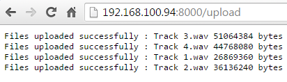
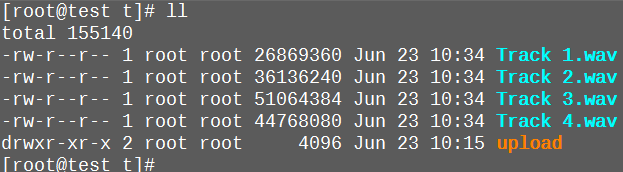
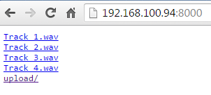

# Fileserver2

A http download and upload server

## Features

* Default to append
* Delete support
* Truncate support
* Form value upload
* File upload

## Examples

### File upload

```
[~ t1 ] $ cat example.log 
example body
[~ t1 ] $ curl localhost:8000/upload -F file=@example.log
Files uploaded successfully : example.log 13 bytes 
[~ t1 ] $
```

Results

```
[~ t ] $ cat example.log 
example body
[~ t ] $ 
```

### Form upload

```
[~ t1 ] $ curl localhost:8000/upload -F file=test -F data="test body"
Files uploaded successfully : test 9 bytes 
[~ t1 ] $ 
```

### Delete

```
[~ t1 ] $ curl localhost:8000/upload -F file=example.log -F delete=yes 
file: example.log deleted
[~ t1 ] $ 
```

### Truncate
if file not exist, it will create the file

if file exist, by default it will append to the file

use truncate to overwrite the file

```
curl localhost:8000/upload -F file=@example.log -F truncate=yes 
```

or

```
curl localhost:8000/upload -F file=test -F data="test body" -F truncate=yes 
```

### Usage

```
Usage of fileserver2:
  -author
        Show author.
  -path string
        File server path. (default ".")
  -port string
        Port number. (default "8000")
  -v    Show version.
```

Notes: **path** specify where the file will be stored


## Web examples

### Choose files


### Info



### Results



## Download example

### Web



### CLI

```
[~ t1 ] $ wget "localhost:8000/Track 1.wav"
--2016-06-23 11:43:18--  http://localhost:8000/Track%201.wav
Resolving localhost... ::1, 127.0.0.1
Connecting to localhost|::1|:8000... connected.
HTTP request sent, awaiting response... 200 OK
Length: 26869360 (26M) [audio/x-wav]
Saving to: `Track 1.wav'

100%[=============================================================================>] 26,869,360  --.-K/s   in 0.1s    

2016-06-23 11:43:18 (240 MB/s) - `Track 1.wav' saved [26869360/26869360]

[~ t1 ] $
```

end
